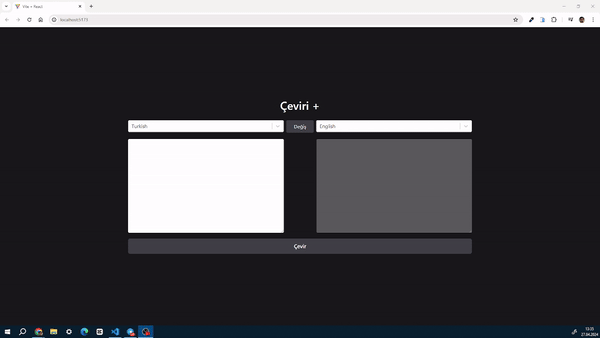

### Translater with Redux Toolkit Thunk
 Translator api ile geliştirdiğim redux toolkit thunkın avantajlarını kullanmak için basit bir translate uygulaması

# Kütüphaneler
- reduxjs/toolkit
- axios 
- react-redux
- taiwind
- react-select

# Ekran Görüntüsü 

# Redux Thunk

- Redux thunk Redux tabanlı uygulamalarda asenkron işlemleri yönetmek için kullanılan  bir middleware (arayazılım)dır.

- Statin storeda tutulduğu Redux tabanlı  uygulamalar senkron yapıda çalışır .Senkron yapıda çalışması bütün işlemler aynı sürede yapılması anlamına geldiğinden . Api çağrıları  gibi cevabın uygulamadan bağımsız bir sürede gerçekleşeceği ve tam olarak ne zaman gerçekleşeceğini bilmedğimiz asenkron işlemler için çıkarılmış bir çözüm yazılımıdır.
- Thunk olmadan Redux tabanlı uygulamlarda api cevaplarını state tutabilmemiz için önce bileşende  api isteği atılır gelen cevap bileşenle birlikte dispatch edilir.Bu da  hem kod kalabalığına hemde her bileşende kod tekrarına sebep olur.
- Sonuç olarak Api isteklerinin sonuçları storeda tutulmak isteniyorsa ve birden çok bileşen tarafından  erişelecekse, Redux Thunk  reduxın senkron yapısında asenkron işlemlerimize yardımcı olan bir ara yazılımdır

# Redux Toolkit Thunk

- Redux Toolkit ile gelenThunk çözümleri daha kolay hale getirmiştir .
- Daha kısa   ve daha basit olması  ile daha  okunabilir bir kod yapısı sunar 
- Redux thunka göre çok daha hızlı bir entegrasyona sahiptir.Buda yapılandırma karmaşıklığını azaltır.

- npm i @reduxjs/toolkit 

- -  Async Thunk aksiyonu, aksiyonu dispatch ettiğimiz zaman yaptığı isteğin durumuna göre otomatik olarak storea farklı aksiyon dispattch eder.

- Pending;, İsteğin yapıldıgı anda aksiyonu tetikler. Asenkron işlemin başladığını belirtir. 

- fulfilled; İstek başarılı oldugunda tetiklenir.Payload kısmı ise asyncThunk methodunda return edilen veridirsa

- rejected; İstekte hata oldugu durumlarda  tetiklenir.İsteğin error kısmına hata detaylarını ekler

- - Thunk aksiyonunun pending,fulfilled,rejected,  aksiyonları tetiklendiğinde store'u nasıl etkileyeceğini söyleyebilmek için 'extraReducers' metodu kullanılır

# Use Memo 

- Bileşen her render olduğunda  içerisinde tuttuğu stateleri baştan sona günceller. Örnek olarak 200 dizi elemanlı bir dizi maplenip ekstra işleme tabi tutuldugunda yeni bir Dizi Döndürür. dolayısıyla her render işleminde gereksiz olarak 400 dizi elemanı tekrardan hesaplar ve performası kötü etkiler .

- Use memo  her render sırasında  tekrar hesaplamayı önleyip Hesaplanmış olan veriyi catchte muhafaza edip  tekrar tekrar kullanabilmemize olanak sağlar 
- UseMemo Tıpkı useEfeect mantıgında çalışır , İki parametre alır bunlardan ilki catche göndermemiz gereken veriyi return eden bir fonksiyon,İkincisi ise   hesaplammaının hangi durumda tekrar yapılmasını isttediğimiz durum   bağımlılık dizisi [languages].(Örneğin languages değişkeni değiştiği anda Tekrar render edilsin )
- Bu sayede sadece sayfa ilk render oldugunda ve languages değişkenin  değeri değiştiği anda hesaplama gerçekleşir ve gereksiz hesaplamaının önüne geçilir